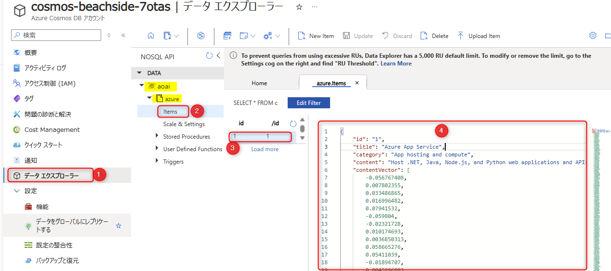

# 🧪 D2. indexer.py の実装

**indexer.py** で Cosmos DB で Vector Search が可能となるデータを登録する処理を実装します。

- [D2-1. ベクター化の処理を実装](./implement-indexer.md#-d2-1-ベクター化の処理を実装)
- [D2-2. Cosmos DB のデータを Upsert](./implement-indexer.md#-d2-2-cosmos-db-のデータを-upsert)
- [NEXT STEP](./implement-indexer.md#️-next-step-)


<br>


## 🔖 前提: 入力のデータについて

- 受け取るデータは、Azure のサービスの情報について以下の Json フォーマットを配列で受信する想定で進めます。
- Azure のサービスの概要が書かれている `content` を Vector search の対象とします。
- 登録するデータは [../data/azure-info.json](../data/azure-info.json) にあります。

```json
[
  {
    "id": "1",
    "title": "Azure App Service",
    "content": "Host .NET, Java, Node.js, and Python web applications and APIs in a fully managed Azure service. You only need to deploy your code to Azure. Azure takes care of all the infrastructure management like high availability, load balancing, and autoscaling.",
    "category": "App hosting and compute"
  },
  {
    "id": "2",
    "title": ....
  }
]

```

<br>

## 🔖 D2-1. ベクター化の処理を実装

エクスプローラーから **indexer.py** を開きます。

最初に、Azure OpenAI Service でベクター化を行う処理を実装し動作確認を行います。

### 実装: ベクター化の処理

実装する内容は以下です。

- Azure OpenAI Service へ接続する client をインスタンス化
- Request Body からデータを取得
- Vector search 対象のテキストをベクター化

> ※ indexer.py のコードをすべて消し、以下コードを貼り付ければ OK です。

```python
# こちらへの対応: https://github.com/microsoft/Oryx/issues/1774
try:
    import azure.functions as func
    from azure.cosmos import CosmosClient
    from openai import AzureOpenAI
    import logging
    import os
except:
    pass

indexer_bp = func.Blueprint()

# Azure OpenAI Service へ接続する client
aoai_client = AzureOpenAI(
    azure_endpoint=os.environ["AOAI_ENDPOINT"],
    api_key=os.environ["AOAI_API_KEY"],
    api_version=os.environ["AOAI_API_VERSION"]
)
# Cosmos DB へ接続する client
cosmos_client = CosmosClient.from_connection_string(os.environ["COSMOS_CONNECTION"])
container = cosmos_client.get_database_client(os.environ["COSMOS_DB_NAME"]).get_container_client(os.environ["COSMOS_CONTAINER_NAME"])


@indexer_bp.function_name(name="upsert-index")
@indexer_bp.route(route="upsert", methods=["POST"], auth_level=func.AuthLevel.ANONYMOUS)
def upsert(req: func.HttpRequest) -> func.HttpResponse:
    # Request body からデータを取得
    docs = req.get_json()
    logging.info(docs)
    doc_count = len(docs)

    for doc in docs:
        # content の内容をベクター化
        content = doc["content"]
        content_vector = aoai_client.embeddings.create(input=content, model=os.environ["AOAI_DEPLOYMENT_NAME_ADA"]).data[0].embedding
        logging.info(f"次元数: {len(content_vector)}")
        logging.info(content_vector)

    return func.HttpResponse(f"{doc_count}件を処理しました。")
```

<br>

### デバッグ実行: ベクター化の処理

Function App をデバッグ実行します。

> [!NOTE]
> エディターにカーソルを当てた状態で `F5` キーを押すとデバッグ実行が開始します。または VS Code 左側のアイコン "Run and Debug" からデバッグ実行できます。

REST.http を開き、`### indexer` の部分を以下のように変更してから、`Send Request` をクリックして API をコールします。

```curl
### indexer
POST http://localhost:7071/api/upsert
Content-Type: application/json

[
  {
    "id": "1",
    "title": "Azure App Service",
    "content": "Azure App Service is a fully managed platform for building, deploying, and scaling web apps. You can host web apps, mobile app backends, and RESTful APIs. It supports a variety of programming languages and frameworks, such as .NET, Java, Node.js, Python, and PHP. The service offers built-in auto-scaling and load balancing capabilities. It also provides integration with other Azure services, such as Azure DevOps, GitHub, and Bitbucket.",
    "category": "Web"
  }
]
```

以下を確認します。

- ✅ Function App が、エラーなく正常に起動すること。
- ✅ REST.http から API をコールし、ベクターの次元数や値がターミナル内でログとして出力されていること。

動作確認が完了したら、デバッグを終了します。

> [!NOTE]
> デバッグの終了方法は、[こちらのページの下部 "デバッグの終了"](./setup-function-app-code.md#デバッグの終了) に記載があります。

<br>

## 🔖 D2-2. Cosmos DB のデータを Upsert

引き続き **indexer.py** で Cosmos DB にデータを登録する処理を実装します。  
Cosmos DB の SDK では Upsert のメソッドが用意されていますのでそれを利用します。

### 実装: Cosmos DB へデータを登録

以下の処理を追加で実装します。

- Cosmos DB へ接続する client をインスタンス化
- Cosmos DB へ登録するスキーマへ変換
- Cosmos DB へデータを登録 (Upsert)

indexer.py を以下のように実装します。  
> ※ indexer.py のコードをすべて消し、以下コードを貼り付ければ OK です。

```python
# こちらへの対応: https://github.com/microsoft/Oryx/issues/1774
try:
    import azure.functions as func
    from azure.cosmos import CosmosClient
    from openai import AzureOpenAI
    import logging
    import os
except:
    pass

indexer_bp = func.Blueprint()

# Azure OpenAI Service へ接続する client
aoai_client = AzureOpenAI(
    azure_endpoint=os.environ["AOAI_ENDPOINT"],
    api_key=os.environ["AOAI_API_KEY"],
    api_version=os.environ["AOAI_API_VERSION"]
)
# Cosmos DB へ接続する client
cosmos_client = CosmosClient.from_connection_string(os.environ["COSMOS_CONNECTION"])
container = cosmos_client.get_database_client(os.environ["COSMOS_DB_NAME"]).get_container_client(os.environ["COSMOS_CONTAINER_NAME"])


@indexer_bp.function_name(name="upsert-index")
@indexer_bp.route(route="upsert", methods=["POST"], auth_level=func.AuthLevel.ANONYMOUS)
def upsert(req: func.HttpRequest) -> func.HttpResponse:
    # Request body からデータを取得
    docs = req.get_json()
    # logging.info(docs)
    doc_count = len(docs)

    for doc in docs:
        # content の内容をベクター化
        content = doc["content"]
        content_vector = aoai_client.embeddings.create(input=content, model=os.environ["AOAI_DEPLOYMENT_NAME_ADA"]).data[0].embedding

        # Cosmos DB へ登録するスキーマへ変換
        item_to_upsert = {
            "id": doc["id"],
            "title": doc["title"],
            "category": doc["category"],
            "content": content,
            "contentVector": content_vector
        }

        container.upsert_item(item_to_upsert)

    return func.HttpResponse(f"{doc_count}件を処理しました。")
```

<br>

### デバッグ実行: Cosmos DB へデータを登録

Function App をデバッグ実行します。

> [!NOTE]
> エディターにカーソルを当てた状態で `F5` キーを押すとデバッグ実行が開始します。または VS Code 左側のアイコン "Run and Debug" からデバッグ実行できます。

REST.http を開き、先ほど同様に `### indexer` の `Send Request` をクリックして API をコールします。

- ✅ Function App をデバッグ実行して正常に起動すること。
- ✅ REST.http から API をコールし、エラーなくレスポンスが返ってくること。

ここまでの確認ができたら、Cosmos DB にデータが登録されていることを確認します。

Azure Portal で Cosmos DB のリソースを開き、以下の手順で確認します。

- 左側のメニュー "データエクスプローラー" をクリック (①)
- aoai データベースの中にある azure コンテナーの Items をクリック (②)
- 登録されているデータを確認 (③、④)



<br>

### デバッグ実行: 複数のデータを登録

ここまでで正常に動作することが確認できたら、サンプルデータである [azure-info.json](../data/azure-info.json) を一括で登録してみます。REST.http の下部に以下を追加して、"Send Request" を実行します。

```curl
### indexer ファイル内のデータを一括で登録
POST http://localhost:7071/api/upsert
Content-Type: application/json

< ../data/azure-info.json
```

正常に動作したら、Azure Portal で Cosmos DB のリソースを開き、先ほど同様にデータが更新されていることを確認します。

下図の更新のボタンをクリックすると、表示されるデータが更新されます。


<br>

動作確認が完了したら、Codespace でデバッグを終了します。

> [!NOTE]
> デバッグの終了方法は、[こちらのページの下部 "デバッグの終了"](./setup-function-app-code.md#デバッグの終了) に記載があります。

<br>

## ⏭️ NEXT STEP ✨

おめでとうございます🎉。以下図に示す Indexer の処理が完成しました。


次は、RAG パターンでの Chat の API で RAG パターンでの回答生成を実現します。

---

[⏮️ 前へ](./setup-function-app-code.md) | [📋 目次](../README.md) | [⏭️ 次へ](./implement-chat.md)
