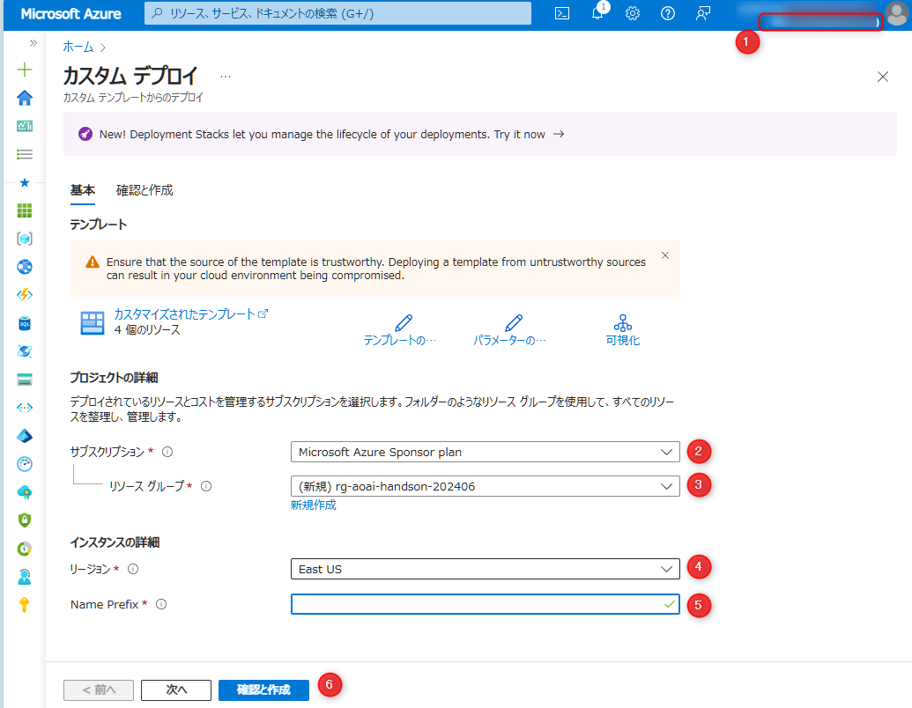
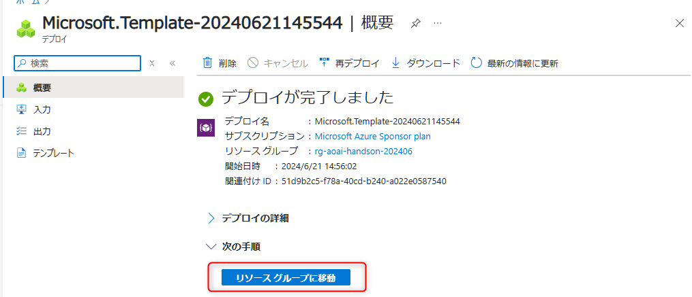
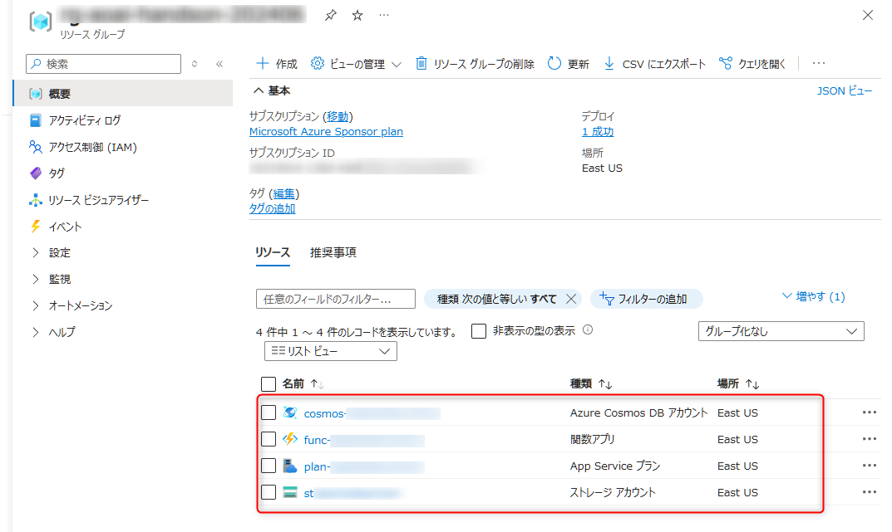
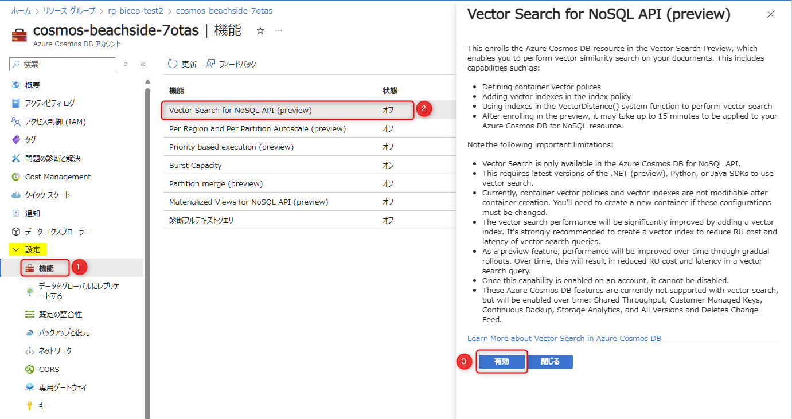
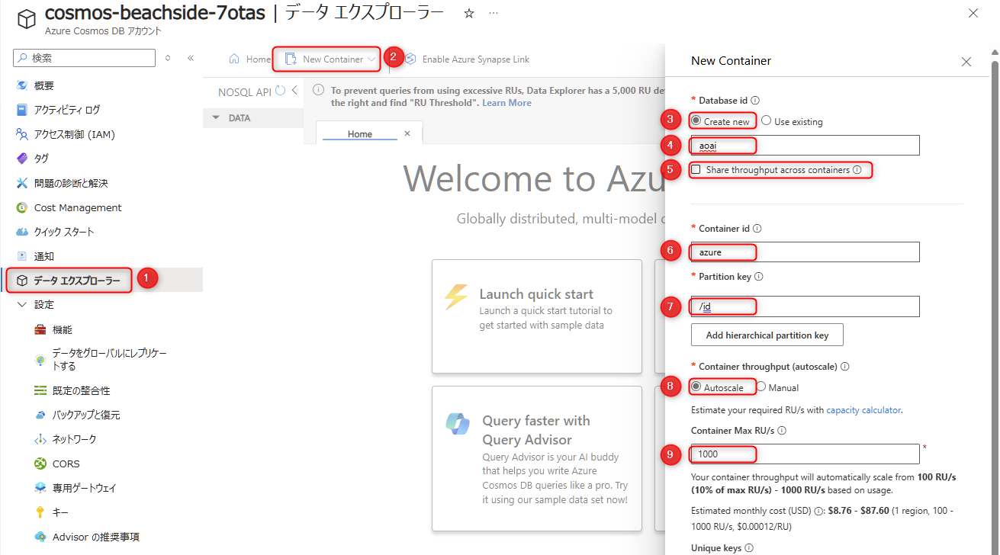
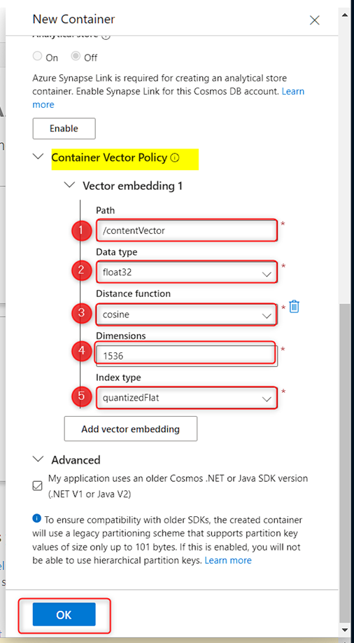

# 🧪 S2. Azure のリソースをセットアップ

ここでは、以下のステップで Azure OpenAI Service 以外の3つのリソースをセットアップします。

- [S2-1. ARM template からリソース作成](./setup-azure-resources.md#-s2-1-arm-template-からリソース作成)
- [S2-2. Cosmos DB: Vector Search 機能の有効化](./setup-azure-resources.md#-s2-2-cosmos-db-vector-search-機能の有効化)
- [S2-3. Azure Cosmos DB: データベース・コンテナーの作成](./setup-azure-resources.md#-s2-3-cosmos-db-データベースコンテナーの作成)
- [NEXT STEP](./setup-azure-resources.md#️-next-step-)

## 🔖 S2-1. ARM template からリソース作成

ハンズオンで利用する以下のリソースを作成します。

- Azure Cosmos DB
- Azure Functions

以下の `Deploy to Azure` のボタンを `CTRL` キー (Mac の場合 `CMD`) を押しながらクリックすることで、別タブで Azure portal に遷移してカスタムデプロイの画面が開きます。


<a href="https://portal.azure.com/#create/Microsoft.Template/uri/https%3A%2F%2Fstyokosandbox.blob.core.windows.net%2Farm-templates%2Faoai-workshop-cosmos-template.json" target="_blank" rel="noopener noreferrer"></a>


<br>

カスタムデプロイ画面では、以下を参考に入力し、"確認と作成" (⑥)をクリックします。

No. | 項目 | 入力内容
---: | --- | ---
1 | 開いている Azure のディレクトリ | ハンズオンで利用するディレクトリであることを確認します。異なる場合は正しいディレクトリを変更します。
2 | サブスクリプション | ハンズオンで利用するサブスクリプションを選択します。
3 | リソース グループ | 既存で使うリソースグループがある場合は選択します。新たに作成したい場合は "新規作成" を選択して名称を入力します。
4 | リージョン | ハンズオンで利用するリージョンを選択します。Azure OpenAI のセットアップで説明した通り "East US" を推奨していますが、自身で判断して利用するリージョンを選択してください。
5 | Name Prefix | リソースにつける任意のプリフィックスを入力します。文字列と数字のみで入力してください。



<br>

"確認と作成" タブで "作成" ボタンをクリックすると、リソースの作成が開始されます。リソースの作成には数分かかりますので、しばらくお待ちください。

リソースが作成できたら、"リソースグループに移動" をクリックして、作成したリソースを確認します。



<br>

リソースグループで、Cosmos DB と Function App のリソースが作成されていることが確認できます。



<br>

> [!NOTE]
> エラーが出た場合は、エラー内容を確認の上作成したリソースをすべて削除して作り直すか、ハンズオンのメンターにご相談ください。  
> "AuthorizationFailed" のエラーが表示され、Resource providers の登録が必要な場合、以下のコマンドを実行することエラーを解決できるケースがあります (実行には Subscription の owner 権限が必要です)。  
> このコマンドは必要な Resource Provider を登録するためのものです。  
>
> ```bash
> curl https://gist.githubusercontent.com/shibayan/e37307ba05a91cac884872505a4625f6/raw/resource-providers.sh | bash
> ```


## 🔖 S2-2. Cosmos DB: Vector Search 機能の有効化

前述から引き続きリソースグループで、Cosmos DB のリソースをクリックして表示して以下の操作をします。

- 左メニュー "設定" 内にある "機能" をクリックし (①) 、"Vector Search for NoSQL API (preview)" が ON になっていることを確認します。
  - この機能が有効になっていることで Cosmos DB (NoSQL) で Vector Search の機能が利用可能になります。

> [!NOTE]
> 既存の Cosmos DB のリソースを利用でこの機能が OFF の場合は以下の手順を参考に有効化します。
>
> - 左メニュー "設定" 内にある "機能" をクリックし (①) 、"Vector Search for NoSQL API (preview)" をクリックします (②)。
> - 有効化する画面が表示されますので、"有効" をクリックします (②)。
> - 5-10分程度で機能が有効化されます。




## 🔖 S2-3. Cosmos DB: データベース・コンテナーの作成

"Vector Search for NoSQL API (preview)" の有効化が完了したら、引き続き Azure Portal の Cosmos DB のリソースで以下の操作をします。

左メニュー "データエクスプローラー" をクリック (①) → "New Container" をクリックして (②)、New Container のペインで以下を参考に入力します。

 No. | 項目 | 入力内容
---: | --- | ---
3 | Database id (Create new) | "Create new" を選択します。
4 | Database id | 「aoai」と入力します。
5 | Share throughput across containers | チェックを**オフ**にします。
6 | Container id | 「azure」と入力します。
7 | Partition key | 「/id」と入力します。
8 | Container throughput (autoscale) | "Autoscale" を選択します。
9 | Container Max RU/s | 「1000」と入力します。



<br>

入力後、下にスクロールして "Container Vector Policy" をクリックして展開し、**"Add vector embedding"** ボタンをクリックします。  
以下図のように UI が表示されますので、以下図を参考に入力します。内容を間違えると Vector search の機能が正しく動作しない可能性がありますので入力にはご注意ください。





<details><summary>※ "Container Vector Policy" で 別の UI (以前のバージョンの UI)が表示される場合はこちら</summary>

前述とは異なる下図にあるような旧 UI が表示される場合は後述を参考にセットアップします。

**Index Policy** と **Container Vector Policy** を展開して値を入力します。

> [!CAUTION]
> 「Index Policy」「Container Vector Policy」のどちらのメニューも表示されていない場合は、Vector Search の有効化が完了していない場合に発生します。5分程度待ってからリロードしてお試しください。  
> どちらか片方のメニューのみ表示される場合は、UI が新しくなっている場合に発生します。その場合は、以下の内容を参考に入力するか、入力方法をメンターにご確認ください。


**Index Policy**の値は以下です。

```json
{
  "indexingMode": "consistent",
  "automatic": true,
  "includedPaths": [
    {
      "path": "/*"
    }
  ],
  "excludedPaths": [
    {
      "path": "/\"_etag\"/?"
    }
  ],
  "vectorIndexes": [
    {
      "path": "/contentVector",
      "type": "quantizedFlat"
    }
  ]
}
```

**Container Vector Policy** の値は以下です。

```json
{
  "vectorEmbeddings": [
    { 
      "path": "/contentVector", 
      "dataType": "float32", 
      "distanceFunction": "cosine", 
      "dimensions": 1536
    }
  ]
}
```


</details>


<br>

入力後、下部にある "OK" ボタンをクリックすると、コンテナーが作成されます。


<br>

Cosmos DB のセットアップは以上です。のちほどこの画面から各種の確認をするので、ブラウザのタブはこのまま開いておきます。

<br>

## 📚 参考情報

Cosmos DB for NoSQL の Vector search 関連:

- [ベクトル データベース | Microsoft Learn](https://learn.microsoft.com/ja-jp/azure/cosmos-db/vector-database)
- [Azure Cosmos DB for NoSQL におけるベクトル検索 (プレビュー) | Microsoft Learn](https://learn.microsoft.com/ja-jp/azure/cosmos-db/nosql/vector-search)

Cosmos DB 全般:

- [Azure Cosmos DB の概要 | Microsoft Learn](https://learn.microsoft.com/ja-jp/azure/cosmos-db/introduction)
- [Azure Cosmos DB で API を選択する | Microsoft Learn](https://learn.microsoft.com/ja-jp/azure/cosmos-db/choose-api)
- [Azure Cosmos DB のデータベース、コンテナー、アイテム | Microsoft Learn](https://learn.microsoft.com/ja-jp/azure/cosmos-db/resource-model)
- [Azure Cosmos DB の要求ユニット(RU) | Microsoft Learn](https://learn.microsoft.com/ja-jp/azure/cosmos-db/request-units)
- [Azure Cosmos DB のデータ モデリング](https://learn.microsoft.com/ja-jp/azure/cosmos-db/nosql/modeling-data)
- [Azure Cosmos DB でのパーティション分割と水平スケーリング | Microsoft Learn](https://learn.microsoft.com/ja-jp/azure/cosmos-db/partitioning-overview)

<br>

## ⏭️ NEXT STEP ✨

おめでとうございます🎉。ワークショップで利用するすべての Azure のリソースの準備が完了しました。次はコードの実装に進みます。

[⏮️ 前へ](./setup-azure-openai.md) | [📋 目次](../README.md) | [⏭️ 次へ](./setup-function-app-code.md)
